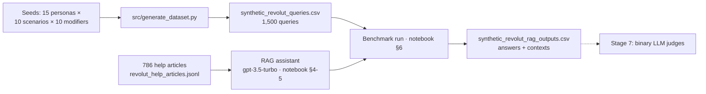

# Revolut FAQ RAG Chatbot — LLM Evaluation Project

An end-to-end evaluation framework for a RAG support assistant over Revolut's public help
center: a controlled 1,500-query synthetic benchmark, an instrumented RAG pipeline, and —
next — binary LLM-as-judge evaluators. Engineered with a spec-driven, verification-first
workflow for AI coding agents.

## Design principles

- **A deliberately weak system under test** (gpt-3.5-turbo). Judges can only be calibrated
  against a system that actually makes mistakes; a strong model would starve the benchmark
  of the very error patterns the judges must learn to catch.
- **Grounded by construction.** Each of the 150 scenarios maps to 2–5 real corpus articles,
  so every query is answerable from the knowledge base.
- **Balanced by construction.** Exactly one query per persona × scenario × modifier
  combination (15 × 10 × 10 = 1,500) — no topic skew to correct after the fact.
- **Realistic by design.** Queries carry persona voice, English proficiency level and
  communication-state modifiers: typos when rushing, dictated run-ons, terse mid-task
  messages.

## How it works



## Quickstart

```bash
uv sync
cp .env.example .env       # add your OPENAI_API_KEY
python3 verify_stage6.py      # recompute all acceptance checks from the artifacts
```

Open `notebooks/faq_rag_chatbot.ipynb` for the full pipeline (sections 1–6, executed
outputs committed).

## Verification-first workflow

This repository assumes the code is written by AI agents, so it trusts artifacts, not
reports:

- **`verify_stage6.py`** — the stage checker: 34 checks recomputed directly from files
  (row counts, exact columns, full-grid completeness, notebook execution evidence,
  secrets). Publishing rule: `main` only at 0 FAIL.
- **`scripts/hooks.py` + `.claude/settings.json`** — rules as code: the checker and
  CLAUDE.md are edit-protected, resumable jobs use a single-writer lock, force-push and
  evidence deletion are blocked, and every agent session ends with the checker verdict
  printed on screen.
- **`specs/`** — one spec per stage with acceptance criteria, evidence-based status and a
  file whitelist; deviations are logged in the spec before code changes.

## Repository map

| File | Purpose |
|---|---|
| `notebooks/faq_rag_chatbot.ipynb` | Project showcase: stages 1–6 with executed outputs — index, retrieval, RAG, benchmark run |
| `src/generate_dataset.py` | Async query generation over the seeds: checkpoints, resume, dedup, style validation |
| `src/config.py` | Single source of truth for models, paths and settings |
| `src/schemas.py` | Pydantic validation of generation outputs |
| `prompts/rag_system.txt`, `prompts/generate_query.txt` | Every LLM prompt lives in a file, never inline |
| `data/revolut_help_articles.jsonl` | Corpus: 786 help-center articles |
| `data/synthetic_data_seeds/*.json` | Benchmark design: 15 personas, 10 modifiers, 150 grounded, topic-balanced scenarios |
| `data/synthetic_revolut_queries.csv` | Benchmark input: 1,500 synthetic user queries |
| `data/synthetic_revolut_rag_outputs.csv` | Stage 6 result: answers, extracted contexts, retrieved articles |
| `verify_stage6.py` | Stage checker (see Verification-first workflow) |
| `scripts/hooks.py`, `.claude/settings.json` | Guard hooks: rules enforced as code |
| `specs/rules.md`, `specs/stage6_dataset_rag.md` | Working rules and the stage contract |
| `CLAUDE.md` | Project rules the coding agent reads every session |
| `reviews/` | Cross-model audit evidence (Claude + Codex, code and data reviews) |
| `pyproject.toml`, `uv.lock` | Reproducible environment |

## Status

- **Stage 6 — synthetic dataset + RAG evaluation run: closed.**
  `verify_stage6.py`: 34 checks, 0 FAIL, 1 accepted WARN (one persona spans 5 topic groups
  instead of 6 — deferred to stage 7).
- **Stage 7 — binary LLM-as-judge evaluators: next** (`specs/stage7_judges.md`).
